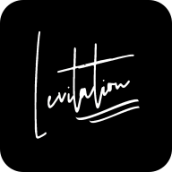
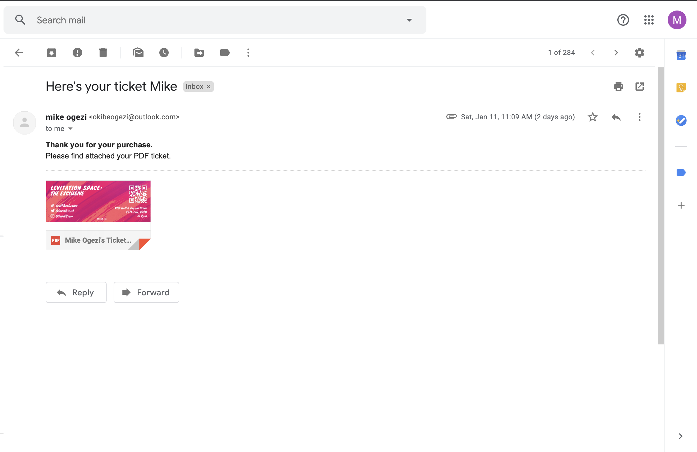

# Levitation Online Ticketing
This is a nodejs express application that allows people purchase tickets for the [Levitation Music Concert](https://levitationconcert.xyz) and other Levitation events online

## Related projects
* The [Levitation Ticket Generator](https://github.com/okibeogezi/levitation-ticket-generator) was used to generate tickets intended for print

## Steps
* Endpoint listens for webhook when a successful payment is recorded
* A ticket is generated with a QR code encoding the buyer's info
* An email attaching the PDF ticket is sent to the buyer's email address

## Integrations
* [Paystack](https://paystack.com)

## Libraries
* [Nodemailer](https://www.npmjs.com/package/nodemailer) for sending emails
* [Jimp](https://www.npmjs.com/package/jimp) for manipulating images
* [QRCode](https://www.npmjs.com/package/qrcode) for encoding data in QR codes
* [Images-To-PDF](https://www.npmjs.com/package/images-to-pdf) for converting the final image to a PDF document

## Using this code
To use this application for your own needs, deploy the application on a PAAS such as [Heroku](https://heroku.com), then set the full `/ticketPayments/webhook` endpoint as the paystack webhook url in paystack's UI. After this, create a payment page and share the link with your customers. With this setup, everytime that a successful payment is made, a request is made to your enpoint and a ticket is generated and emailed to the email address supplied in the request.

Since this application makes use of Nodemailer, you will have to provide the email address and password to your Outlook account as the environment variables; `EMAIL` and `PASSWORD`. If you are using another email provider such as yahoo or gmail you may have to modify, the mail transport parameters used in the `src/mail.js` file.

Also, note that the `TICKET_PRICE` environment variable sets the ticket price that is accepted as a valid purchase. I set that in the `package.json` file.

## Email

## Ticket

